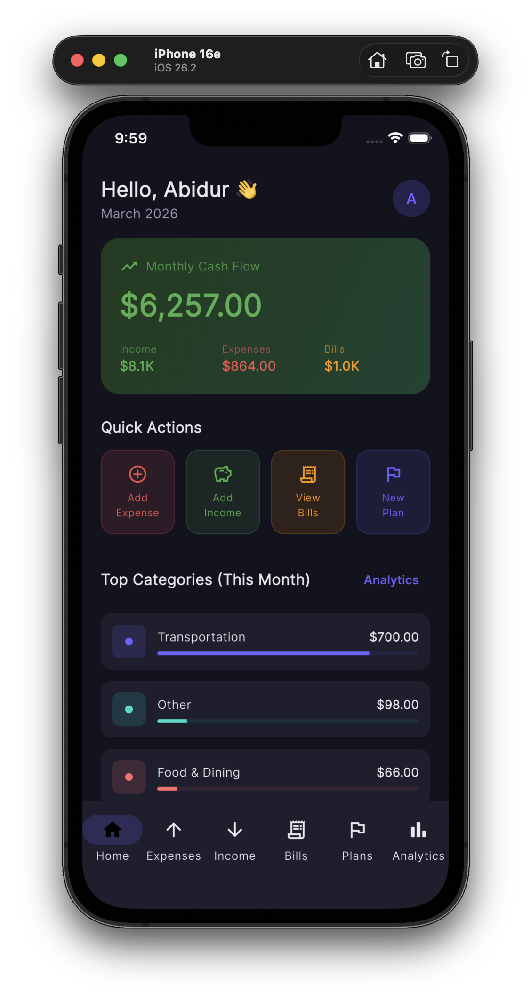
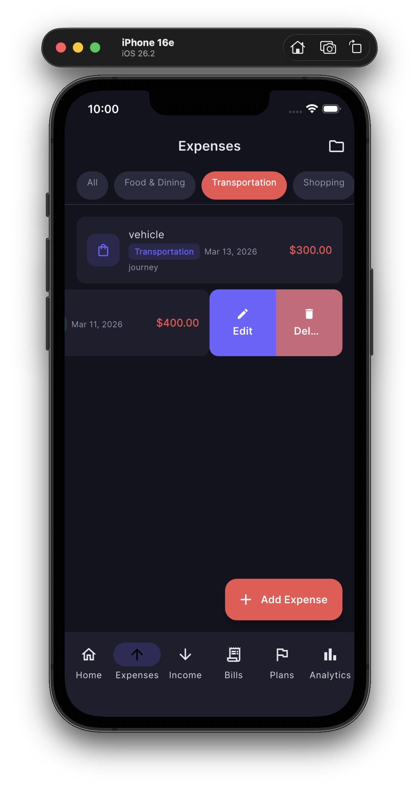
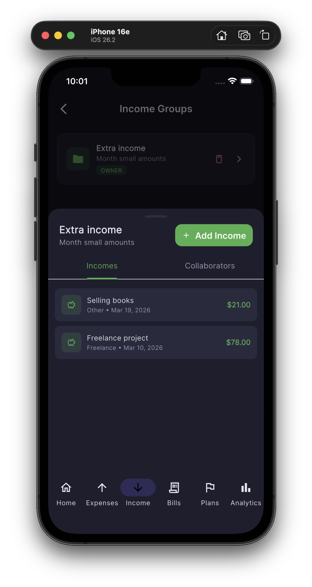
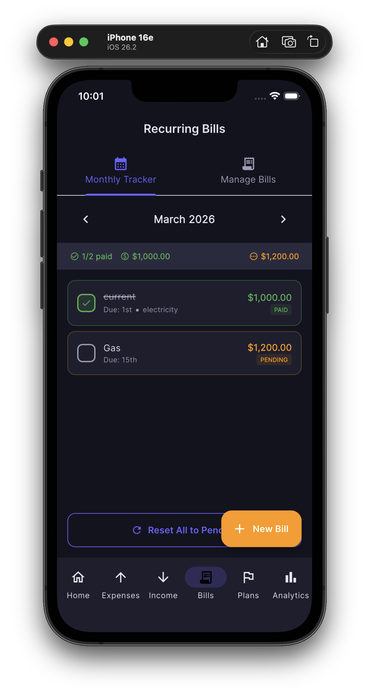
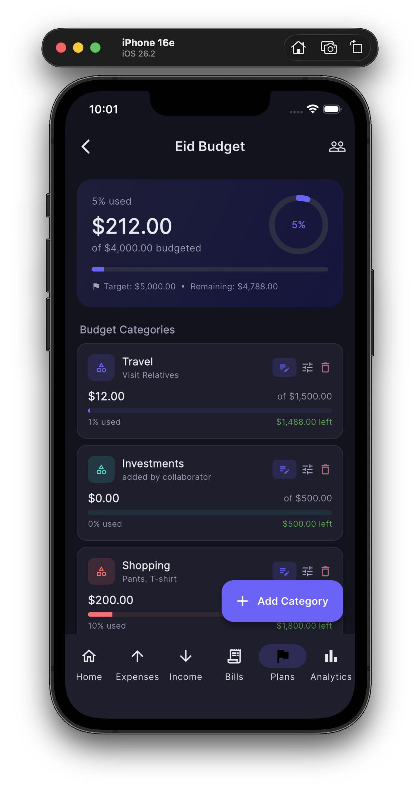
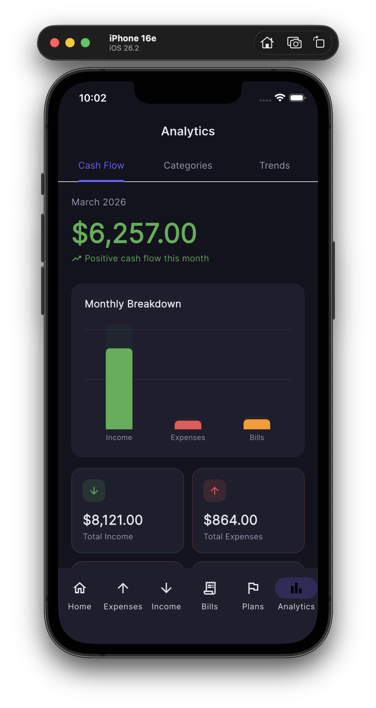
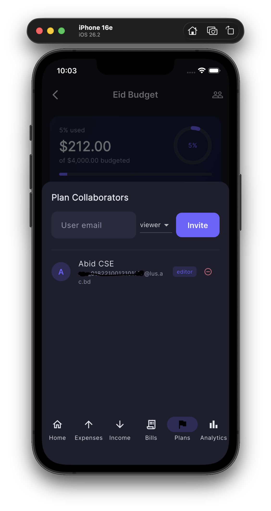
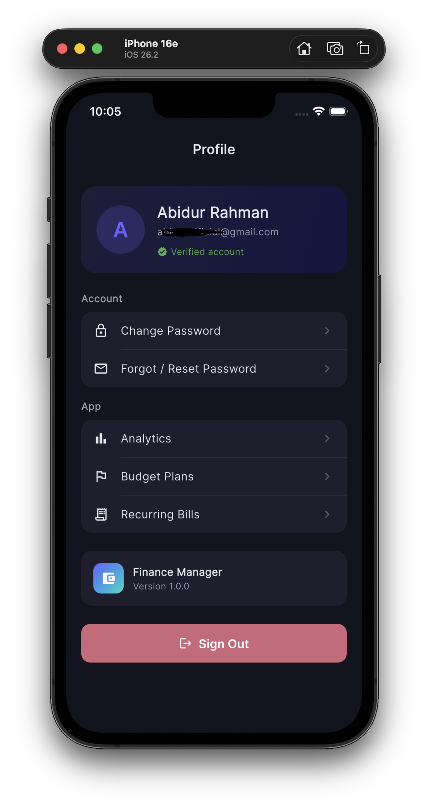

<div align="center">

# Finance Manager

### A full-featured personal finance mobile app built with Flutter

[](https://flutter.dev)
[](https://dart.dev)
[](https://riverpod.dev)
[](LICENSE)

*Track expenses, manage income, monitor bills, plan budgets, and visualise your financial health - all in one mobile app.*

</div>

---

## App Screenshots

| Dashboard | Expenses | Inocome | Recurring Bills |
|----------|----------|-----------|--------------|
|  |  |  |  |

| Plans | Analytics | Collaboration | Profile |
|-------------|--------|-------|---------|
|  |  |  |  |

---

## Features

### Authentication
- Register with name, email, and password
- Email verification flow
- Login with JWT access + refresh tokens
- Automatic silent token refresh on expiry
- Forgot password / reset via email link
- Change password from profile
- Secure token storage using device keychain / keystore

### Dashboard
- Monthly cash flow banner (income vs. expenses vs. bills)
- Quick action buttons (Add Expense, Add Income, View Bills, New Plan)
- Top 5 spending categories with progress bars
- Recent 5 expenses list
- Tap avatar to navigate to Profile

### Expenses
- Add, edit, delete expenses with title, amount, category, date, notes, and receipt image
- 13 built-in categories (Food & Dining, Transport, Shopping, etc.)
- Filter by category and/or expense group
- Infinite scroll pagination
- Swipe left to reveal Edit and Delete actions
- **Expense Groups** — shared groups with collaborators (viewer / editor roles)
  - Add expenses directly to a group
  - View all expenses in a group in one place
  - Invite collaborators by email, remove them with confirmation

### Income
- Full CRUD matching expense features
- 9 built-in categories (Salary, Freelance, Business, etc.)
- Filter by category and/or income group
- **Income Groups** — same collaborator system as expense groups
  - Add income directly to a group
  - View grouped income
  - Invite and remove collaborators

### Bills
- Add recurring bills with name, amount, and due-day-of-month
- Monthly payment tracker — toggle each bill paid / pending
- Visual status badges and summary (paid count, paid amount, pending amount)
- Reset all bills to pending for the new month

### Budget Plans
- Create plans with optional target amount and date range
- Add budget categories with expected spend limits
- Track actual vs. budgeted spend per category with circular and linear progress indicators
- Over-budget warnings in red
- Collaborators — share plans with team members (viewer / editor)
- Update spent amount per category (add or subtract)

### Analytics
Three tabs powered by `fl_chart`:
- **Cash Flow** — bar chart comparing income, expenses, and paid bills for the current month, plus four summary cards
- **Categories** — pie chart of spending by category with a detailed breakdown list and percentage bars
- **Trends** — 12-month line chart with area fill showing monthly spending history

### Profile
- View account name, email, and verification status
- Change password
- Quick links to Analytics, Plans, and Bills
- Sign out with confirmation dialog

---

## Architecture

The project follows **MVVM** with a clean-layer separation:

```
lib/
├── main.dart                         # App entry point
├── app_router.dart                   # GoRouter: auth guard + shell route
│
├── core/
│   ├── constants/
│   │   ├── app_constants.dart        # Base URL, storage keys, category lists
│   │   └── app_theme.dart           # Dark theme, colour palette, Material 3
│   ├── network/
│   │   ├── api_client.dart           # Dio singleton + JWT interceptor + auto-refresh
│   │   └── api_exception.dart        # Typed API error
│   └── utils/
│       └── formatters.dart           # CurrencyFormatter, DateFormatter
│
├── data/
│   ├── models/                       # Plain Dart data classes with fromJson()
│   │   ├── user_model.dart
│   │   ├── expense_model.dart        # ExpenseModel, ExpenseGroupModel, PaginatedExpenses
│   │   ├── income_model.dart
│   │   ├── bill_model.dart           # BillModel, BillPaymentStatus
│   │   ├── plan_model.dart           # PlanModel, PlanItemModel, PlanWithItems, CollaboratorModel
│   │   └── analytics_model.dart      # CashFlow, CategoryAnalytics, MonthlyTrend
│   └── repositories/                 # All API calls live here (single responsibility)
│       ├── auth_repository.dart
│       ├── expense_repository.dart
│       ├── income_repository.dart
│       ├── bill_repository.dart
│       ├── plan_repository.dart
│       └── analytics_repository.dart
│
└── presentation/
    ├── providers/                    # Riverpod state management
    │   ├── auth_provider.dart        # AuthNotifier (StateNotifier)
    │   ├── expense_provider.dart     # ExpensesNotifier + ExpenseGroupsNotifier
    │   └── providers.dart            # Income, Bills, Plans, Analytics providers
    ├── widgets/
    │   └── common/
    │       └── app_widgets.dart      # AppButton, AppTextField, SummaryCard,
    │                                 # EmptyState, ShimmerLoader, CategoryBadge,
    │                                 # showConfirmDialog
    └── screens/
        ├── auth/                     # Login, Register, ForgotPassword
        ├── dashboard/                # DashboardScreen
        ├── expenses/                 # ExpensesScreen, ExpenseFormScreen, ExpenseGroupsScreen
        ├── incomes/                  # IncomesScreen, IncomeFormScreen, IncomeGroupsScreen
        ├── bills/                    # BillsScreen (tabs: Monthly Tracker | Manage Bills)
        ├── plans/                    # PlansScreen, PlanDetailScreen
        ├── analytics/                # AnalyticsScreen (tabs: Cash Flow | Categories | Trends)
        └── profile/                  # ProfileScreen
```

---

## App Flow

```
┌─────────────────────────────────────────────────────────────────────────┐
│                            APP LAUNCH                                   │
└─────────────────────────────┬───────────────────────────────────────────┘
                              │  Check keychain for access token
              ┌───────────────┴───────────────┐
              │                               │
        Token found                      No token
              │                               │
    Fetch /auth/me ◄──── 401 ────►  /login screen
              │                               │
      ┌───────┴───────┐               Register / Login
      │               │                      │
    Success        Failure               /dashboard
      │               │
 /dashboard        /login
      │
      ▼
┌─────────────────────────── MAIN SHELL ─────────────────────────────────┐
│                                                                        │
│  ┌──────────┐  ┌──────────┐  ┌──────────┐  ┌──────────┐  ┌──────────┐  │
│  │  Home    │  │ Expenses │  │  Income  │  │  Bills   │  │  Plans   │  │
│  │Dashboard │  │  + Groups│  │ + Groups │  │ Tracker  │  │ + Detail │  │
│  └──────────┘  └──────────┘  └──────────┘  └──────────┘  └──────────┘  │
│                                                                        │
│  ┌──────────┐                                                          │
│  │Analytics │  ◄── All tabs share bottom navigation bar                │
│  │3 charts  │      Profile accessible via dashboard avatar             │
│  └──────────┘                                                          │
└────────────────────────────────────────────────────────────────────────┘

JWT REFRESH FLOW:
  Request ──► API ──► 401 ──► POST /auth/refresh ──► Retry original request
                                     │
                               Refresh fails
                                     │
                               Clear tokens ──► /login
```

---

## Tech Stack

| Layer | Technology | Purpose |
|-------|-----------|---------|
| UI Framework | Flutter 3.19+ | Cross-platform mobile UI |
| Language | Dart 3.0+ | Null-safe, strongly typed |
| State Management | Riverpod 2.5 | Providers, StateNotifier, AsyncNotifier |
| Navigation | GoRouter 13 | Declarative routing, auth guard, shell route |
| HTTP Client | Dio 5.4 | REST calls, interceptors, multipart upload |
| Secure Storage | flutter_secure_storage 9 | Encrypted JWT storage (Keychain / Keystore) |
| Charts | fl_chart 0.68 | Bar, pie, and line charts |
| Fonts | Google Fonts (Inter) | Clean, modern typography |
| Slidable Lists | flutter_slidable 3.1 | Swipe-to-action list items |
| Progress Indicators | percent_indicator 4.2 | Circular progress in plan detail |
| Date/Currency | intl 0.19 | Locale-aware formatting |
| Image Upload | image_picker 1.1 | Attach receipt photos |
| Backend | Node.js + Express + Prisma + PostgreSQL | REST API (hosted on Render) |

---

## 🚀 Getting Started

### Installation

```bash
# 1. Clone the repository
git clone https://github.com/abidurrahman11/finance-manager.git
cd finance-manager

# 2. Install dependencies
flutter pub get

# 3. Run on a connected device or emulator
flutter run

# 4. Build a release APK (Android)
flutter build apk --release

# 5. Build for iOS (requires macOS + Xcode)
flutter build ios --release
```

---

## Configuration

### Backend URL

The app points to a hosted backend. To use your own, update `lib/core/constants/app_constants.dart`:

```dart
static const String baseUrl = 'https://your-backend-url.com/api';
```

### Backend API (self-hosting)

The backend is a **Node.js + Express + Prisma + PostgreSQL** REST API. To run it locally:

```bash
git clone https://github.com/abidurrahman11/finance-manager-backend.git
cd finance-manager-backend
npm install
# Create .env with DATABASE_URL, JWT_SECRET, etc.
npx prisma migrate dev
npm run dev
```

---

## API Reference

All endpoints are prefixed with `/api`.

<details>
<summary><strong>Authentication</strong> — <code>/auth</code></summary>

| Method | Endpoint | Description |
|--------|----------|-------------|
| POST | `/auth/register` | Create account |
| POST | `/auth/login` | Login, returns access + refresh tokens |
| GET | `/auth/me` | Get current user |
| POST | `/auth/refresh` | Refresh access token |
| POST | `/auth/logout` | Invalidate refresh token |
| POST | `/auth/change-password` | Change password (authenticated) |
| POST | `/auth/forgot-password` | Send reset email |
| POST | `/auth/reset-password/:token` | Reset password |
| GET | `/auth/verify-email/:token` | Verify email |
| POST | `/auth/resend-verification` | Resend verification email |

</details>

<details>
<summary><strong>Expenses</strong> — <code>/expenses</code></summary>

| Method | Endpoint | Description |
|--------|----------|-------------|
| GET | `/expenses` | List expenses (paginated, filterable) |
| POST | `/expenses` | Create expense (multipart with optional image) |
| PUT | `/expenses/:id` | Update expense |
| DELETE | `/expenses/:id` | Delete expense |
| GET | `/expenses/groups` | List groups |
| POST | `/expenses/groups` | Create group |
| PUT | `/expenses/groups/:id` | Update group |
| DELETE | `/expenses/groups/:id` | Delete group |
| GET | `/expenses/groups/:id/collaborators` | List collaborators |
| POST | `/expenses/groups/:id/collaborators` | Add collaborator |
| DELETE | `/expenses/groups/:id/collaborators/:userId` | Remove collaborator |

</details>

<details>
<summary><strong>Income</strong> — <code>/incomes</code> (mirrors Expenses)</summary>

Same structure as `/expenses` — CRUD for incomes and income groups with collaborator management.

</details>

<details>
<summary><strong>Bills</strong> — <code>/bills</code></summary>

| Method | Endpoint | Description |
|--------|----------|-------------|
| GET | `/bills` | List recurring bills |
| POST | `/bills` | Create bill |
| PUT | `/bills/:id` | Update bill |
| DELETE | `/bills/:id` | Delete bill |
| GET | `/bills/payments?month=YYYY-MM` | Get payment status for month |
| POST | `/bills/:id/payments` | Mark bill paid/pending |
| POST | `/bills/reset` | Reset all to pending |

</details>

<details>
<summary><strong>Budget Plans</strong> — <code>/plans</code></summary>

| Method | Endpoint | Description |
|--------|----------|-------------|
| GET | `/plans` | List plans |
| POST | `/plans` | Create plan |
| GET | `/plans/:id` | Get plan with all items |
| PUT | `/plans/:id` | Update plan |
| DELETE | `/plans/:id` | Delete plan |
| POST | `/plans/:id/items` | Add budget category item |
| PUT | `/plans/:id/items/:itemId` | Update item |
| DELETE | `/plans/:id/items/:itemId` | Delete item |
| POST | `/plans/:id/items/:itemId/spent` | Update spent amount |
| GET/POST/DELETE | `/plans/:id/collaborators/...` | Collaborator management |

</details>

<details>
<summary><strong>Analytics</strong> — <code>/analytics</code></summary>

All accept optional `startDate` and `endDate` query params (`YYYY-MM-DD`).

| Method | Endpoint | Description |
|--------|----------|-------------|
| GET | `/analytics/summary` | Total count, spend, average |
| GET | `/analytics/by-category` | Spend grouped by category |
| GET | `/analytics/monthly-trends` | Monthly spend for last 12 months |
| GET | `/analytics/cash-flow` | Income vs. expenses vs. bills |

</details>

---

## 👨‍💻 Author

**Abidur Rahman**
- GitHub: [@abidurrahman11](https://github.com/abidurrahman11)
- LinkedIn: [linkedin.com/in/abidurrahman11](https://linkedin.com/in/abidurrahman11)
- Portfolio: [yourportfolio.com](https://abidurrahman11.github.io)

---

<div align="center">

</div>
